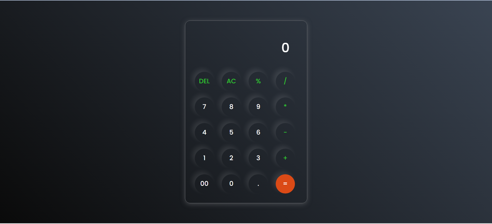

# CALCULATOR
# 💻 Neumorphic Calculator

A stylish and fully functional calculator built using **HTML**, **CSS**, and **JavaScript**. It performs basic arithmetic operations and includes features like delete, all-clear, decimal input, and percentage. The calculator is designed with a modern **neumorphic UI**, giving it a clean and intuitive appearance.

---

## ✨ Features

- Basic operations: `+`, `-`, `*`, `/`
- Special functions: `DEL`, `AC`, `%`, `.`
- Real-time input display
- Responsive layout
- Modern neumorphism-based UI
- Error handling for invalid expressions

---

## 📸 Screenshot

---

## 🛠️ Tech Stack

- **HTML5** – structure
- **CSS3** – neumorphic design styling
- **JavaScript** – calculator logic and event handling

---
